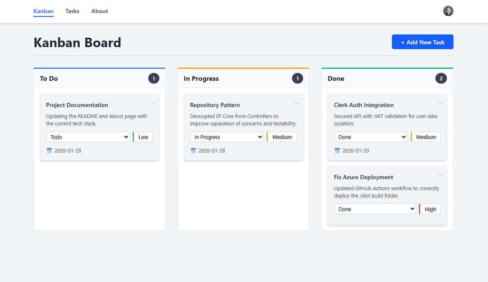

# Kanban Board

A Kanban board application built with **ASP.NET Web API**, **React + TypeScript**, **Tailwind CSS**, and **PostgreSQL**, deployed on **Azure** with automated CI/CD.

---

## 🚀 Live Demo

-   **Frontend:** [Azure Static Web Apps](https://brave-cliff-0698b8403.3.azurestaticapps.net/)
-   **Backend API:** [Azure App Service](https://your-backend-url.azurewebsites.net)

---

## 🏗️ Architecture

### Project Structure
```
kanban-board/
├── backend/
│   └── KanbanBoard.Api/
│       ├── Controllers/
│       ├── Data/
│       ├── Models/
│       └── Migrations/
├── frontend/
│   └── src/
│       ├── components/
│       ├── pages/
│       └── services/
└── screenshots/
```

### Deployment Architecture
```
GitHub → Actions → Azure Static Web Apps (Frontend)
                → Azure App Service (Backend)
                → Neon PostgreSQL (Database)
```

### Infrastructure

-   **Frontend:** Azure Static Web Apps
-   **Backend:** Azure App Service
-   **Database:** Neon PostgreSQL
-   **CI/CD:** GitHub Actions (automated deployment on push to `main`)

---

## 📸 Screenshots



**Additional Views:**
-   [Tasks List View](screenshots/tasks-list.png)
-   [Mobile View](screenshots/mobile.png)
-   [Create Task Modal](screenshots/create-task.png)

---

## 🛠️ Tech Stack

### Frontend

-   React with TypeScript
-   Vite
-   Tailwind CSS
-   React Router
-   Responsive design (cards on mobile, table on desktop)

### Backend

-   ASP.NET Web API (.NET 9)
-   Entity Framework Core
-   PostgreSQL (Neon)
-   RESTful CRUD API
-   CORS configured for Azure deployment

---

## 📦 Features

-   **Multi-page application**
    -   Kanban Board (Home)
    -   Tasks List View
    -   About Page
-   Create tasks with modal form
-   Delete tasks with confirmation modal
-   Update task status via dropdown
-   Priority levels (Low, Medium, High)
-   Due date tracking
-   Fully responsive UI
-   Active navigation state
-   Sticky navbar

---

## 🧭 Pages

| Page             | Route    | Description                                                   |
| ---------------- | -------- | ------------------------------------------------------------- |
| **Kanban Board** | `/`      | Visual workflow with three columns (To Do, In Progress, Done) |
| **Tasks List**   | `/tasks` | Table view of all tasks with filters                          |
| **About**        | `/about` | Project information and tech stack                            |

---

## 🔌 API Endpoints

| Method   | Endpoint          | Description       |
| -------- | ----------------- | ----------------- |
| `GET`    | `/api/tasks`      | Get all tasks     |
| `POST`   | `/api/tasks`      | Create a new task |
| `PUT`    | `/api/tasks/{id}` | Update task by ID |
| `DELETE` | `/api/tasks/{id}` | Delete task by ID |

---

## 🗄️ Database Schema

**TaskItem Model:**

-   `id` (int) - Primary key
-   `title` (string) - Task title
-   `description` (string) - Optional description
-   `status` (int) - 0=To Do, 1=In Progress, 2=Done
-   `priority` (int) - 1-2=Low, 3-4=Medium, 5=High
-   `dueDate` (DateTime) - Optional due date
-   `createdAt` (DateTime) - Creation timestamp
-   `updatedAt` (DateTime) - Last update timestamp

---

## ⚙️ Running Locally

### Backend
```bash
cd backend/KanbanBoard.Api
dotnet restore
dotnet run
```

Backend runs at `https://localhost:5001`

### Frontend
```bash
cd frontend
npm install
npm run dev
```

Frontend runs at `http://localhost:5173`

### Environment Variables

**Frontend** (`frontend/.env`):
```
VITE_API_URL=https://localhost:5001
```

**Backend** (`backend/KanbanBoard.Api/appsettings.json`):
```json
{
    "ConnectionStrings": {
        "DefaultConnection": "your-postgresql-connection-string"
    }
}
```

---

## 📄 License

MIT
