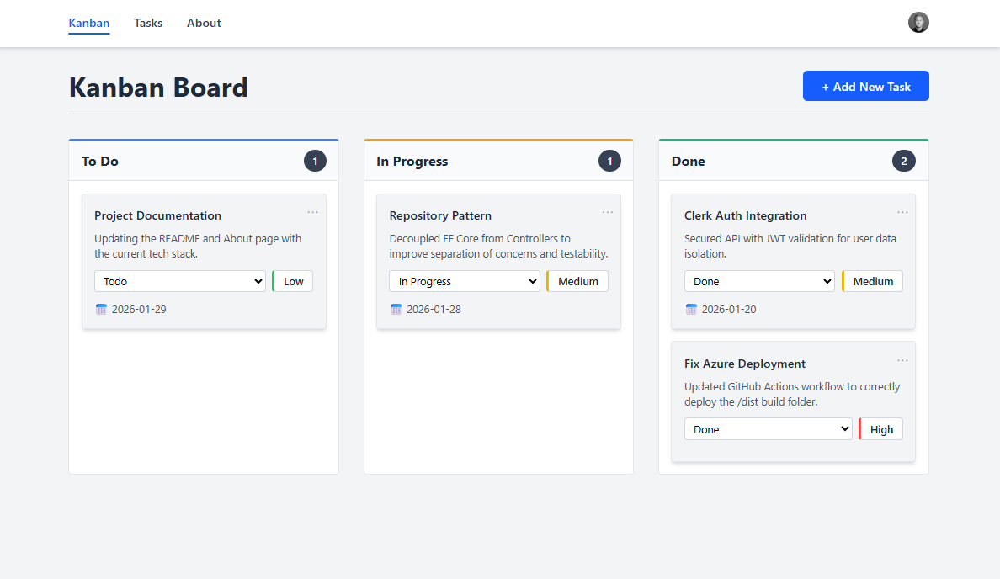

# Kanban Board

A Kanban board application built with **ASP.NET Web API**, **React + TypeScript**, **Tailwind CSS**, and **PostgreSQL**, secured with **Clerk**, deployed on **Azure** with automated CI/CD.

---

## 🚀 Live Demo

- **Frontend:** [Azure Static Web Apps](https://brave-cliff-0698b8403.3.azurestaticapps.net/)
- **Backend API:** [Azure App Service](https://kanban-board-api-fpd0akbzhgb8d7ey.westeurope-01.azurewebsites.net/swagger/)

---
## 🏗️ Architecture

### Project Structure

```
kanban-board/
├── backend/
│   └── KanbanBoard.Api/
│       ├── Controllers/
│       ├── Data/
│       ├── Mappings/
│       ├── Migrations/
│       ├── Models/
│       └── Repositories/
├── frontend/
│   └── src/
│       ├── components/
│       ├── pages/
│       ├── services/
│       └── types/
└── screenshots/
```
### Infrastructure

- **Frontend:** Azure Static Web Apps
- **Backend:** Azure App Service
- **Database:** Neon PostgreSQL
- **Security:** Clerk JWT
- **CI/CD:** GitHub Actions (automated deployment on push to `main`)

---

## 🛠️ Tech Stack

**Backend:** ASP.NET Web API (.NET 9), Entity Framework Core, PostgreSQL (Neon), RESTful API, Repository Pattern  
**Frontend:** React, TypeScript, Vite, Tailwind CSS, React Router  
**Auth:** Clerk (JWT)

---

## 📦 Features

- Create, update, delete tasks
- Status management (Kanban board view)
- Priority and due date tracking
- Responsive UI
- Secure user authentication

---

## 📸 Screenshots



---

## 🔌 API Endpoints

| Method   | Endpoint          | Description       |
| -------- | ----------------- | ----------------- |
| `GET`    | `/api/tasks`      | Get all tasks     |
| `POST`   | `/api/tasks`      | Create a new task |
| `PUT`    | `/api/tasks/{id}` | Update task by ID |
| `DELETE` | `/api/tasks/{id}` | Delete task by ID |

---

## ⚙️ Running Locally

### Backend

```bash
cd backend/KanbanBoard.Api
dotnet restore
dotnet run
```

Backend runs at `https://localhost:5001`

### Frontend

```bash
cd frontend
npm install
npm run dev
```

Frontend runs at `http://localhost:5173`

### Environment Variables

**Frontend** (`frontend/.env`):

```
VITE_API_URL=https://localhost:5001
VITE_CLERK_PUBLISHABLE_KEY=your_clerk_key_here
```

**Backend** (`backend/KanbanBoard.Api/appsettings.json`):

```json
{
    "ConnectionStrings": {
        "DefaultConnection": "your-postgresql-connection-string"
    }
    "Clerk": {
    "Authority": "https://clerk.your-domain.com",
    "Audience": null
  }
}
```

---

## 📄 License

MIT
